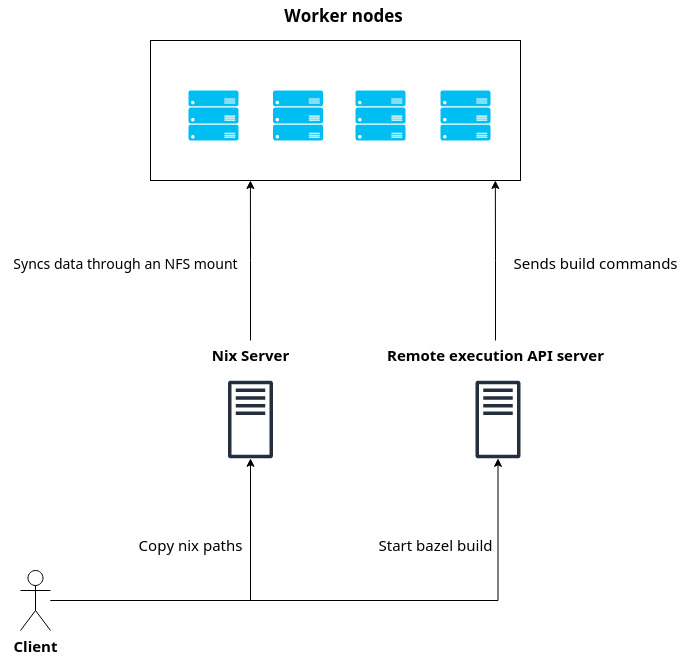

# Remote execution infrastructure for Nix+Bazel

This repository contains the necessary configuration files for setting up and operating
infrastructure components required for Bazel Remote Execution with [rules_nixpkgs][rules_nixpkgs].

It includes configurations for the [Buildbarn][buildbarn] remote execution API implementation,
deployed on Kubernetes. Future expansions to include more implementations are possible.

*Note: This is currently in the proof of concept phase and is not recommended for production usage.*

## Pre-requisites

- AWS account: The infrastructure terraform configs are using AWS. Specifically they will create EC2
  instances, EBS volumes, certificates, ALBs and EKS clusters.
- [terraform][terraform]: Used for creating all cloud resources.
- [ansible][ansible]: To provision the Nix server.
- [helm][helm] & [helmfile][helmfile]: To provision the Kubernetes resources.
- [Nix][nix]: Although not strictly necessary for deployment, it is used to test the setup by
  building the [rules_nixpkgs][rules_nixpkgs] Bazel project.

## Components

While specific details may vary between deployments, the infrastructure typically comprises the
following three components:

- **Remote execution server**: Buildbarn GRPC API server.
- **Remote execution workers**: Buildbarn executors.
- **Nix server**: Holds the remote nix store and provides an NFS share (`/nix/store`) that is mounted on all workers.

Here is a diagram with the above:



### How it works

Integrating remote execution with Nix poses a significant challenge, as the workers, which may not
have Nix installed, do not recognize the Nix paths instantiated on our local machine.

Our solution involves transferring any Nix paths generated by rules_nixpkgs to the Nix server via
SSH. The Nix server's `/nix/store` is then replicated to the workers through a read-only NFS mount.

This process occurs prior to remote execution, ensuring that the required Nix paths are accessible to
the Bazel workers during the build phase.

### Local setup

Follow the steps below to utilize the remote execution infrastructure, assuming all components are
provisioned and operational.

1. Update your `rules_nixpkgs` repository to its latest version.
2. Modify your SSH configuration (`~/.ssh/config`) to include an entry for the Nix server

```
Host nix-server
  Hostname 10.0.1.0 # To be replaced with the actual IP (could be public)
  User ubuntu
  Port 22
  IdentityFile ~/.ssh/nix # SSH key of the server.
```

3. Make the SSH host known to rules_nixpkgs by setting the `BAZEL_NIX_REMOTE` environment variable:

```bash
export BAZEL_NIX_REMOTE=nix-server
```

This instructs the `rules_nixpkgs` rules to transfer our Nix store paths to the remote server, making
them available on the workers.

4. Update your `.bazelrc` file as follows, replacing placeholders with appropriate values:

```conf
build --remote_timeout=3600
build --remote_executor=grpc://<REMOTE_API_ADDR>:<REMOTE_API_PORT>
build --remote_header=x-api-key=<API_KEY> # This is a basic authentication token used on the ingress.
```

5. Initiate the Bazel build process.

You can use the [bb-deployments][bb-deployments] repo as an example test out the deployment.

```bash
git clone https://github.com/buildbarn/bb-deployments

cd bb-deployments

# Update .bazelrc with the service endpoint from the Kubernetes deploument.
bazel build --config=remote-ubuntu-22-04 @abseil-hello//...
```

## Deployment

For detailed deployment instructions, refer to [Buildbarn](./buildbarn/README.md)

[rules_nixpkgs]: https://github.com/tweag/rules_nixpkgs
[buildbarn]: https://github.com/buildbarn
[terraform]: https://github.com/hashicorp/terraform
[ansible]: https://github.com/ansible/ansible
[helm]: https://github.com/helm/helm
[helmfile]: https://github.com/helmfile/helmfile
[nix]: https://nixos.org/
[bb-deployments]: https://github.com/buildbarn/bb-deployments
